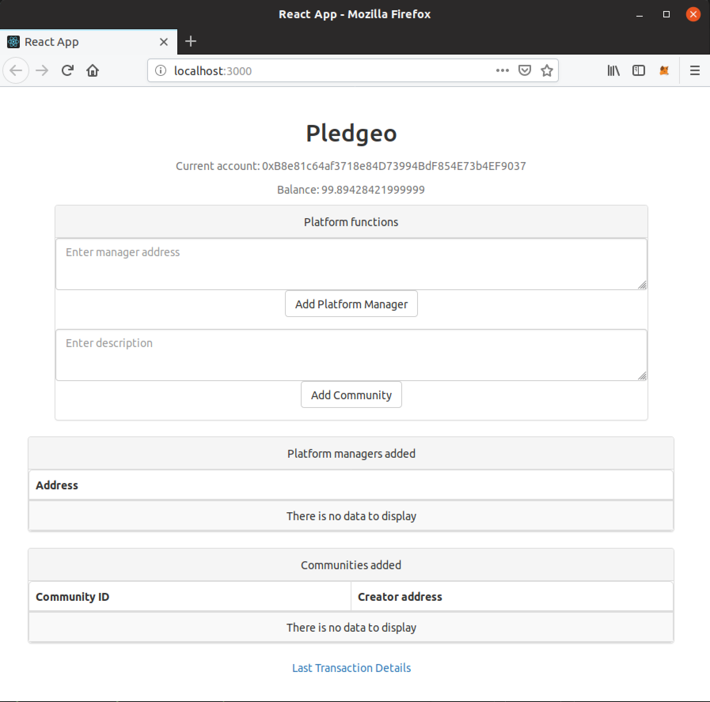

Pledgeo - Consensys Academy's 2018 Developer Program Final Project
===

## Table of contents:

- [What does this project do?](#what-does-this-project-do)
    - [Participants and user stories](#participants-and-user-stories)
- [Built with](#built-with)
- [Design pattern decisions](https://github.com/loic1/symmetrical-waffle/blob/master/design_pattern_decisions.md)
- [Avoiding common attacks](https://github.com/loic1/symmetrical-waffle/blob/master/avoiding_common_attacks.md)
- [Installing and running the app](#installing-and-running-the-app)
- [How to use this app?](#how-to-use-this-app)
- [Deployed addresses](https://github.com/loic1/symmetrical-waffle/blob/master/deployed_addresses.txt)
- [Future work](#future-work)
- [Lessons learned](#lessons-learned)
- [Related readings](#related-readings)

## What does this project do?

This project aims at facilitating the emergence of and the outreach to rural, untapped market opportunities, with the potential to unlock new revenues and create positive social impact.

It relies on an Ethereum-based decentralized application ([dapp](https://www.quora.com/What-is-a-DApp)) that attemps to engineer aligned vested interests for all participants to create and attend business events through the use of escrow contracts.

If successful, this platform could make small and remote communities more attractive to conduct business into, thus boosting their economies. By being able to aggregate more efficiently their demand, locals could reduce the scale and remoteness barrier to economic inclusion and make businesses come to them rather than doing without them or having to go to larger urban areas to gain access to them, effectively reversing commutes. On the other side, businesses could grow by extending their reach to new prospects.

A key reason to rely on Ethereum to implement the platform is the use of smart contracts that act as escrow agreements. Indeed, the platform involves automatically locking, releasing, and sometimes redistributing participants' money on a regular basis. The agreed-upon rules and conditions establishing these processes should therefore be clear and transparent, and the processes themselves, work with both reliability and short delays to deliver dues. What's more, network participants can benefit from lower commission fees compared to common centralized platforms, thus capturing more of the value they create.

### Participants and user stories

The participants interact with one another through **Events** (e.g. a foreign language class, a seasonal pop-up shop, etc), of which the state is among one of the following: **Suggested**, **Submitted**, **Approved**, **Dropped**, **Cancelled**, **Disputed**, or **Concluded**. Events take place within **Communities**, which can be villages, neighborhoods, etc. The platform forms a four-sided market, of which the participants are: 
- **Consumers** can join communities, and within one, they can also join *Submitted* events, as well as suggest adding new ones (they are posted with the *Suggested* state). In both cases, they are asked to prove their good faith by putting a certain amount of ether in an escrow contract, which they are refunded - minus a small commission intended for paying the business owner’s transportation cost - once it is acknowledged that they attended the event. Consumers can reduce this small commission by referring others, allowing for tribal marketing.
- **Business owners** - be it a company, an independent contract, a teacher, etc - can submit event proposals (they are posted with the *Submitted* state) which come with the incentive structure of their choice, as well as accept those suggested by consumers. They too are asked to prove their good faith by putting a certain amount of ether (greater than the consumers) in an escrow contract, which they are refunded once it is acknowledged that they organized the event. The platform doesn't handle actual payments for the goods and services provided during an event.
- **Room owners** represent any person, business, or public organization, that is willing to give access to a room to host an event. It can be a public facility, a private conference room, someone’s living room or basement, or a dedicated pop up shop space. This is optional and compensated for by an increased commission on the event.
- **Platform managers** can add and remove communities, as well as settle *Disputed* events. For the time being, they are whitelisted by the contract owner. As the platform matures, this will be  opened up (e.g.: through a voting system, reputation, or other kinds of governance models) and further developed to add more responsibilities in running the platform (e.g.: acting as some sort of customer service as well as digital chamber of commerce). In the meantime, although controlled by a central authority, the actions taken by the platform managers are processed on chain, and therefore fully transparent.

*Suggested* and *Submitted* events need to be approved by a business owner before the specified deadline. If it happens, the state changes to *Approved*, else, it changes to *Dropped*. An *Approved* event can be cancelled (changes to the *Cancelled* state), but the business owner loses their pledge. Likewise, participants can leave an *Approved* event, losing their pledge as well. During an *Approved* event, the business owner, as well as any participants, can submit a complaint, changing the state of the event to *Disputed*. The platform managers are then required to settle the dispute and conclude the event. Without any complaint, the event concludes itself 24 hours after its end. In both cases, the event reaches its final state, *Concluded*. 

It is worth mentionning, the pledge for adding and joining an event should be high enough to deter spam, but also, low enough so it doesn't become a barrier to entry and it considers the case where a participant has a valid reason not to act upon their words (e.g.: gets sick), in which case, they won't get a refund (as the platform matures, community managers could play the role of mediators and better handle customer service).

## Built with

The smart contracts are written in [Solidity](https://solidity.readthedocs.io/) and compiled using solc version 0.5.0.

They can be deployed to an [Ethereum](https://ethereum.org) blockchain, be it the public [mainnet](https://etherscan.io), a public testnet like [Rinkeby](https://rinkeby.etherscan.io), a private production blockchain, or on a local development blockchain like [Ganache](https://truffleframework.com/ganache) and [Truffle Develop](https://truffleframework.com/docs/truffle/getting-started/using-truffle-develop-and-the-console).

A simple React.js app that connects to the Ethereum back-end using [Web3.js](https://web3js.readthedocs.io) allows to interact with the platform directly in the browser.

The Ethereum contracts rely on three OpenZeppelin libraries:
- Ownable contract
- Pausable contract
- SafeMath library

## Design pattern decisions

See [design_pattern_decisions.md](design_pattern_decisions.md)

## Avoiding common attacks

See [avoiding_common_attacks.md](avoiding_common_attacks.md)

## Installing and running the app

Prerequisites: Node.js, git, [MetaMask](https://metamask.io/) extension in Chrome or Firefox.

1. Install Truffle and Ganache globally (if not already installed):
```
$ npm install -g truffle
$ npm install -g ganache-cli
```
2. Start a local blockchain using Ganache:
```
$ ganache-cli
```
3. Open another terminal, clone this repository, and cd into it:
```
$ git clone https://github.com/loic1/Pledgeo
$ cd pledgeo/
```
4. Compile and migrate the contracts to the blockchain:
```
$ truffle compile
$ truffle migrate
```
5. Run the tests to make sure the contracts and the blockchain are working properly:
```
$ truffle test
```
6. Copy the mnemonic seed phrase from Ganache (see exemple below), open the browser and paste it in Metamask, and check that it points to a private network on localhost port 8445:
```
HD Wallet
==================
Mnemonic:      ensure cactus knee bright baby coral shove fame winner outdoor staff infant

```
7. Cd into ./client, install the node modules, and serve a local instance of the application on your machine:
The server will launch the app at http://localhost:3000
```
$ cd ./client/
$ npm install
$ npm start
```
8. Done! :tada: If everything goes well, you will see this:



## How to use this app?

When Metamask pops up, approve the execution to access the app. Add the address of another account to make them platform manager and click on the corresponding button. This should trigger a second Metamask pop up window asking to approve and sign the transaction. After confirming, the new platform manager should be added to the list. They are then able to add a new community, where, in turn, a business owner or a consumer can add an event.

## Deployed addresses

See [deployed_addresses.txt](deployed_addresses.txt)

## Future work

- Implement Oraclize or Ethereum Alarm Clock
- Add number of recurrences and recurrence interval to business event parameters
- Implement business event privacy levels (public, private, secret)
- Optimize gas consumption
- Make mobile UI with QR codes to validate attendance
- Consider adding localization information to the business event validation process
- Adding a new type of participant: chamber of commerce members, of which the role would be to lobby for the development of new infrastructures and laws in favor of the ecosystem at the community level

## Lessons learned

- It is not possible at the moment to change the address of the message sender when calling a unit test function in Solidity; one must rely on JavaScript tests instead
- It is not possible at the moment to get enumerations and mappings with JavaScript tests; one must define their own getters

## Related readings

- https://truffleframework.com/docs
- https://beta.kauri.io/article/86903f66d39d4379a2e70bd583700ecf/truffle:-adding-a-frontend-with-react-box
- https://thenextweb.com/contributors/2017/11/03/gig-economy-needs-blockchain/ 

*Keywords: blockchain for economic inclusion; scale as competitive advantage; innovative rural business models to spread opportunity in small towns.*

## Acknowledgments

Inspiration from family and friends

## Thank you for reading!